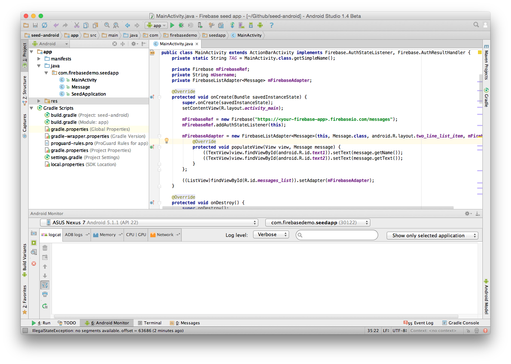

Android + Firebase Seed App
=========================

This is a seed application to help you get started building apps with [Android](https://www.android.com/) and Firebase.
Using [FirebaseUI-Android](https://github.com/firebase/FirebaseUI-Android/) this app implements a `ListView` of messages (automatically synchronized with the data in
the Firebase database), log in with email and password and the ability to add new messages.


## Getting Started

> For a general introduction, see the documentation on [programming Android apps using Firebase](https://www.firebase.com/docs/android/).

Clone this repo to your local machine:

```
git clone git@github.com:firebase/seed-android.git
```

Open the directory in Android Studio.

If you are missing any build tools, SDKs or other dependencies, Android Studio will tell you about it.


Accept all its suggestions and your Android Studio should look like this:



Open `app/java/com.firebasedemo.seedap/MainActivity.java` and change line 31 to point to your own Firebase Database.

## Running your app

Run the seed app by clicking the "Run 'app'" button in the toolbar (or by pressing `ctrl-R` on the keyboard).

You can run the app in physical Android device or in an emulator that runs on your machine.
The app will run on Android Gingerbread (2.3.3, API level 10) or up.


## How it Works

> If you want to learn how to build this application from scratch yourself, take our [FirebaseUI for Android codelab](https://github.com/firebase/FirebaseUI-Android/tree/master/codelabs/chat).

This app is built using FirebaseUI for Android, which in turn is built on top of the Firebase SDK for Android.

It uses a `FirebaseListAdapter` to adapt messages in the Firebase Database to a `ListView` in the app.

The app uses the Firebase SDK for Android to create a reference to the Firebase Database and to send new message to the database.

### Email & password authentication

This app makes use of Firebase's [email & password authentication](https://www.firebase.com/docs/web/guide/login/password.html).
To enable email & password auth, navigate to the "Login & Auth" tab in your Firebase app dashboard and select "Enable Email & Password Authentication".

Once it's enabled, you're ready to start creating and authenticating users in your app.
The app creates users with `Firebase.createUser()` method from the Firebase SDK for Android, passing it an email and password.
It uses `Firebase.authWithPassword()` to log users in, and `Firebase.unauth()` to log users out.
This app also makes use of `Firebase.AuthStateListener` to check the user's authentication state and set `mUserName` to the current user.

Firebase also supports authentication with Facebook, Twitter, GitHub, Google, anonymous auth, and custom authentication. Check out the docs on user authentication for details on these authentication methods.

Adding messages to a synchronized array

This app uses the `FirebaseListAdapter` from the FirebaseUI library for Android to synchronize message data from the Firebase database to our app.
Using `FirebaseListAdapter`, our local `ListView` is kept in sync with our remote Firebase data.
To add items to the database, the app uses `Firebase.push()` and `Firebase.setValue()`.
Check out the Firebase for Android documentation for more details on how this works.

#### Adding messages
This app makes use of an `TextEdit` for text input, and uses the `push()` and `setValue()` methods to push messages to the `/messages` node of your Firebase database.
These messages are of the form:

```
{
  email: 'email@domain.com',
  text: 'Literally cronut post-ironic, shabby chic distillery PBR&B.'
}
```

For more information on saving data to Firebase, check out our [saving data docs](https://www.firebase.com/docs/android/guide/saving-data.html).

#### Displaying messages
This app makes use of [FirebaseUI](https://github.com/firebase/FirebaseUI-Android) to bind a Firebase database reference to a `ListView`.

It overrides the `populateView()` method of the `FirebaseListAdapter` to populate the sub-views of an `R.layout.message_item`.

More information is available in the [Firebase docs](https://www.firebase.com/docs/android/guide/retrieving-data.html) and in the regular Firebase [retrieving data docs](https://www.firebase.com/docs/ios/guide/retrieving-data.html).

## Securing your app
Copy and paste the contents of `rules.json` into the Security & Rules tab of your Firebase App Dashboard.

`rules.json` has two basic security rules. The first ensures that only logged in users can add messages to the list:

` ".write": "auth != null"`

The second rule ensures that new messages are not empty:

`".validate": "newData.hasChildren(['email', 'text'])"`

`.validate` rules are run after `.write` rules succeed. You can see the full rules in the `rules.json` file.

For more details on security rules, check out the [security quickstart](https://www.firebase.com/docs/security/quickstart.html) in our documentation.

## Deploying your app
For more information on deploying your app to the Google Play Store, check out the [Google Play site](http://developer.android.com/distribute/googleplay/index.html).

## Repo Structure
The top level of the repo contains project metadata, including the `README`, `CONTRIBUTORS`, and `LICENSE`.

Additionally, it contains all of the source code for the project.

`rules.json` contains the security rules for the project. For more information, see the [Securing your App](https://github.com/firebase/seed-android#securing-your-app) section of this README.

## Next Steps

### Community

Firebase has an active developer community consisting of over 230,000 developers. There are a number of different channels for contributing to our community, including:

1. [Stack Overflow](http://www.stackoverflow.com/tags/firebase)
1. [Firebase Talk Google Group](https://groups.google.com/forum/#!forum/firebase-talk)
1. [Twitter](https://twitter.com/firebase)
1. [Facebook](https://www.facebook.com/Firebase)
1. [Google+](http://plus.google.com/115330003035930967645)

Additional information on the community, help, or support can be found on our [help page](https://www.firebase.com/docs/help/).

### Contributing

We'd love to accept your sample apps and patches! Before we can take them, we a few business items to take care of including our CLA and an overview of our contribution process. Please view [CONTRIBUTING.md](https://github.com/firebase/seed-android/blob/master/CONTRIBUTING.md) for more information.

1. Submit an issue describing your proposed change to the repo in question.
1. The repo owner will respond to your issue promptly.
1. If your proposed change is accepted, and you haven't already done so, sign a
   Contributor License Agreement (see details above).
1. Fork the desired repo, develop and test your code changes.
1. Ensure that your code adheres to the existing style of the library to which
   you are contributing.
1. Ensure that your code has an appropriate set of unit tests which all pass.
1. Submit a pull request.
